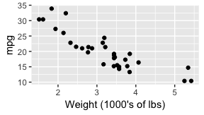

cm014 Worksheet: The Model-Fitting Paradigm in R
================

``` r
suppressPackageStartupMessages(library(tidyverse))
```

    ## Warning: package 'dplyr' was built under R version 3.5.1

``` r
library(gapminder)
library(broom)
```

So you want to fit a model to your data. How can you achieve this with R?

Topics:

1.  What *is* model-fitting?
2.  How do we fit a model in R?
3.  How can we obtain tidy results from the model output?

What is Model-Fitting?
----------------------

When variables are not independent, then we can gain information about one variable if we know something about the other.

Examples: Use the scatterplot below:

1.  A car weighs 4000 lbs. What can we say about its mpg?
2.  A car weights less than 3000 lbs. What can we say about its mpg?

``` r
ggplot(mtcars, aes(wt, mpg)) +
  geom_point() +
  labs(x = "Weight (1000's of lbs)")
```



Example: What can we say about rear axle ratio if we know something about quarter mile time?

``` r
ggplot(mtcars, aes(qsec, drat)) + 
  geom_point() +
  labs(x = "Quarter mile time",
       y = "Rear axle ratio")
```


If EDA isn't enough, we can answer these questions by fitting a model: a curve that predicts Y given X. Aka, a **regression curve** or a **machine learning model**.

(There are more comprehensive models too, such as modelling entire distributions, but that's not what we're doing here)

There are typically two goals of fitting a model:

1.  Make predictions.
2.  Interpret variable relationships.

Fitting a model in R
--------------------

Model fitting methods tend to use a common format in R:

    method(formula, data, options)

They also tend to have a common output: a special *list*.

**Method**:

A function such as:

-   Linear Regression: `lm`
-   Generalized Linear Regression: `glm`
-   Local regression: `loess`
-   Quantile regression: `quantreg::rq`
-   ...

**Formula**:

In R, takes the form `y ~ x1 + x2 + ... + xp` (use column names in your data frame).

**Data**: The data frame.

**Options**: Specific to the method.

Exercise:

1.  Fit a linear regression model to life expectancy ("Y") from log(GDP per capita) ("X") by filling in the formula. Notice what appears as the output.
2.  On a new line, use the `unclass` function to uncover the object's true nature: a list. Note: it might be easier to use the `names` function to see what components are included in the list.

``` r
(my_lm <- lm(lifeExp~log(gdpPercap), data=gapminder))
```

    ## 
    ## Call:
    ## lm(formula = lifeExp ~ log(gdpPercap), data = gapminder)
    ## 
    ## Coefficients:
    ##    (Intercept)  log(gdpPercap)  
    ##         -9.101           8.405

``` r
str(unclass(my_lm))
```

    ## List of 12
    ##  $ coefficients : Named num [1:2] -9.1 8.41
    ##   ..- attr(*, "names")= chr [1:2] "(Intercept)" "log(gdpPercap)"
    ##  $ residuals    : Named num [1:1704] -18.1 -17 -15.6 -13.4 -10.3 ...
    ##   ..- attr(*, "names")= chr [1:1704] "1" "2" "3" "4" ...
    ##  $ effects      : Named num [1:1704] -2455.08 430.51 -14.77 -12.57 -9.44 ...
    ##   ..- attr(*, "names")= chr [1:1704] "(Intercept)" "log(gdpPercap)" "" "" ...
    ##  $ rank         : int 2
    ##  $ fitted.values: Named num [1:1704] 46.9 47.3 47.6 47.5 46.4 ...
    ##   ..- attr(*, "names")= chr [1:1704] "1" "2" "3" "4" ...
    ##  $ assign       : int [1:2] 0 1
    ##  $ qr           :List of 5
    ##   ..$ qr   : num [1:1704, 1:2] -41.2795 0.0242 0.0242 0.0242 0.0242 ...
    ##   .. ..- attr(*, "dimnames")=List of 2
    ##   .. .. ..$ : chr [1:1704] "1" "2" "3" "4" ...
    ##   .. .. ..$ : chr [1:2] "(Intercept)" "log(gdpPercap)"
    ##   .. ..- attr(*, "assign")= int [1:2] 0 1
    ##   ..$ qraux: num [1:2] 1.02 1.03
    ##   ..$ pivot: int [1:2] 1 2
    ##   ..$ tol  : num 1e-07
    ##   ..$ rank : int 2
    ##   ..- attr(*, "class")= chr "qr"
    ##  $ df.residual  : int 1702
    ##  $ xlevels      : Named list()
    ##  $ call         : language lm(formula = lifeExp ~ log(gdpPercap), data = gapminder)
    ##  $ terms        :Classes 'terms', 'formula'  language lifeExp ~ log(gdpPercap)
    ##   .. ..- attr(*, "variables")= language list(lifeExp, log(gdpPercap))
    ##   .. ..- attr(*, "factors")= int [1:2, 1] 0 1
    ##   .. .. ..- attr(*, "dimnames")=List of 2
    ##   .. .. .. ..$ : chr [1:2] "lifeExp" "log(gdpPercap)"
    ##   .. .. .. ..$ : chr "log(gdpPercap)"
    ##   .. ..- attr(*, "term.labels")= chr "log(gdpPercap)"
    ##   .. ..- attr(*, "order")= int 1
    ##   .. ..- attr(*, "intercept")= int 1
    ##   .. ..- attr(*, "response")= int 1
    ##   .. ..- attr(*, ".Environment")=<environment: R_GlobalEnv> 
    ##   .. ..- attr(*, "predvars")= language list(lifeExp, log(gdpPercap))
    ##   .. ..- attr(*, "dataClasses")= Named chr [1:2] "numeric" "numeric"
    ##   .. .. ..- attr(*, "names")= chr [1:2] "lifeExp" "log(gdpPercap)"
    ##  $ model        :'data.frame':   1704 obs. of  2 variables:
    ##   ..$ lifeExp       : num [1:1704] 28.8 30.3 32 34 36.1 ...
    ##   ..$ log(gdpPercap): num [1:1704] 6.66 6.71 6.75 6.73 6.61 ...
    ##   ..- attr(*, "terms")=Classes 'terms', 'formula'  language lifeExp ~ log(gdpPercap)
    ##   .. .. ..- attr(*, "variables")= language list(lifeExp, log(gdpPercap))
    ##   .. .. ..- attr(*, "factors")= int [1:2, 1] 0 1
    ##   .. .. .. ..- attr(*, "dimnames")=List of 2
    ##   .. .. .. .. ..$ : chr [1:2] "lifeExp" "log(gdpPercap)"
    ##   .. .. .. .. ..$ : chr "log(gdpPercap)"
    ##   .. .. ..- attr(*, "term.labels")= chr "log(gdpPercap)"
    ##   .. .. ..- attr(*, "order")= int 1
    ##   .. .. ..- attr(*, "intercept")= int 1
    ##   .. .. ..- attr(*, "response")= int 1
    ##   .. .. ..- attr(*, ".Environment")=<environment: R_GlobalEnv> 
    ##   .. .. ..- attr(*, "predvars")= language list(lifeExp, log(gdpPercap))
    ##   .. .. ..- attr(*, "dataClasses")= Named chr [1:2] "numeric" "numeric"
    ##   .. .. .. ..- attr(*, "names")= chr [1:2] "lifeExp" "log(gdpPercap)"

``` r
names(my_lm)
```

    ##  [1] "coefficients"  "residuals"     "effects"       "rank"         
    ##  [5] "fitted.values" "assign"        "qr"            "df.residual"  
    ##  [9] "xlevels"       "call"          "terms"         "model"

``` r
my_lm$coefficients
```

    ##    (Intercept) log(gdpPercap) 
    ##      -9.100889       8.405085

To complicate things further, some info is stored in *another* list after applying the `summary` function:

``` r
summary(my_lm) %>% 
  names()
```

    ##  [1] "call"          "terms"         "residuals"     "coefficients" 
    ##  [5] "aliased"       "sigma"         "df"            "r.squared"    
    ##  [9] "adj.r.squared" "fstatistic"    "cov.unscaled"

We can use the `predict()` function to make predictions from the model (default is to use fitting/training data). Here are the predictions:

``` r
predict(my_lm, newdata = tibble(gdpPercap=c(750,800,850)))
```

    ##        1        2        3 
    ## 46.54139 47.08384 47.59340

``` r
gapminder %>% head()
```

    ## # A tibble: 6 x 6
    ##   country     continent  year lifeExp      pop gdpPercap
    ##   <fct>       <fct>     <int>   <dbl>    <int>     <dbl>
    ## 1 Afghanistan Asia       1952    28.8  8425333      779.
    ## 2 Afghanistan Asia       1957    30.3  9240934      821.
    ## 3 Afghanistan Asia       1962    32.0 10267083      853.
    ## 4 Afghanistan Asia       1967    34.0 11537966      836.
    ## 5 Afghanistan Asia       1972    36.1 13079460      740.
    ## 6 Afghanistan Asia       1977    38.4 14880372      786.

We can plot models (with one predictor/ X variable) using `ggplot2` through the `geom_smooth()` layer. Specifying `method="lm"` gives us the linear regression fit (but only visually!):

``` r
ggplot(gapminder, aes(gdpPercap, lifeExp)) +
    geom_point() +
    geom_smooth(method="lm") +
    scale_x_log10()
```


Broom
-----

Let's make it easier to extract info, using the `broom` package. There are three crown functions in this package, all of which input a fitted model, and outputs a tidy data frame.

1.  `tidy`: extract statistical summaries about each component of the model.
    -   Useful for *interpretation* task.
2.  `augment`: add columns to the original data frame, giving information corresponding to each row.
    -   Useful for *prediction* task.
3.  `glance`: extract statistical summaries about the model as a whole (1-row tibble).
    -   Useful for checking goodness of fit.

Exercise: apply all three functions to our fitted model, `my_lm`. What do you see?

``` r
str(tidy(my_lm))
```

    ## Classes 'tbl_df', 'tbl' and 'data.frame':    2 obs. of  5 variables:
    ##  $ term     : chr  "(Intercept)" "log(gdpPercap)"
    ##  $ estimate : num  -9.1 8.41
    ##  $ std.error: num  1.228 0.149
    ##  $ statistic: num  -7.41 56.5
    ##  $ p.value  : num  1.93e-13 0.00

``` r
tidy(my_lm)
```

    ## # A tibble: 2 x 5
    ##   term           estimate std.error statistic  p.value
    ##   <chr>             <dbl>     <dbl>     <dbl>    <dbl>
    ## 1 (Intercept)       -9.10     1.23      -7.41 1.93e-13
    ## 2 log(gdpPercap)     8.41     0.149     56.5  0.

``` r
augment(my_lm,newdata=tibble(gdpPercap=c(400,500,600)))
```

    ## # A tibble: 3 x 3
    ##   gdpPercap .fitted .se.fit
    ## *     <dbl>   <dbl>   <dbl>
    ## 1       400    41.3   0.372
    ## 2       500    43.1   0.343
    ## 3       600    44.7   0.321

``` r
glance(my_lm)
```

    ## # A tibble: 1 x 11
    ##   r.squared adj.r.squared sigma statistic p.value    df logLik    AIC
    ## *     <dbl>         <dbl> <dbl>     <dbl>   <dbl> <int>  <dbl>  <dbl>
    ## 1     0.652         0.652  7.62     3192.       0     2 -5877. 11760.
    ## # ... with 3 more variables: BIC <dbl>, deviance <dbl>, df.residual <int>

``` r
glance(my_lm)$p.value
```

    ## [1] 0
